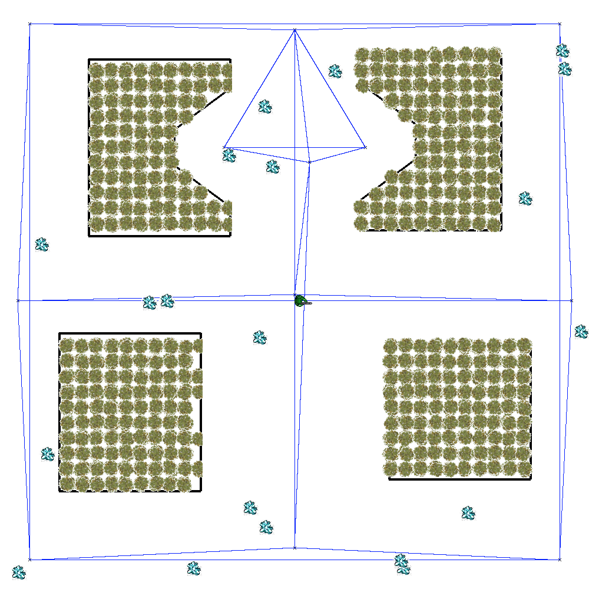
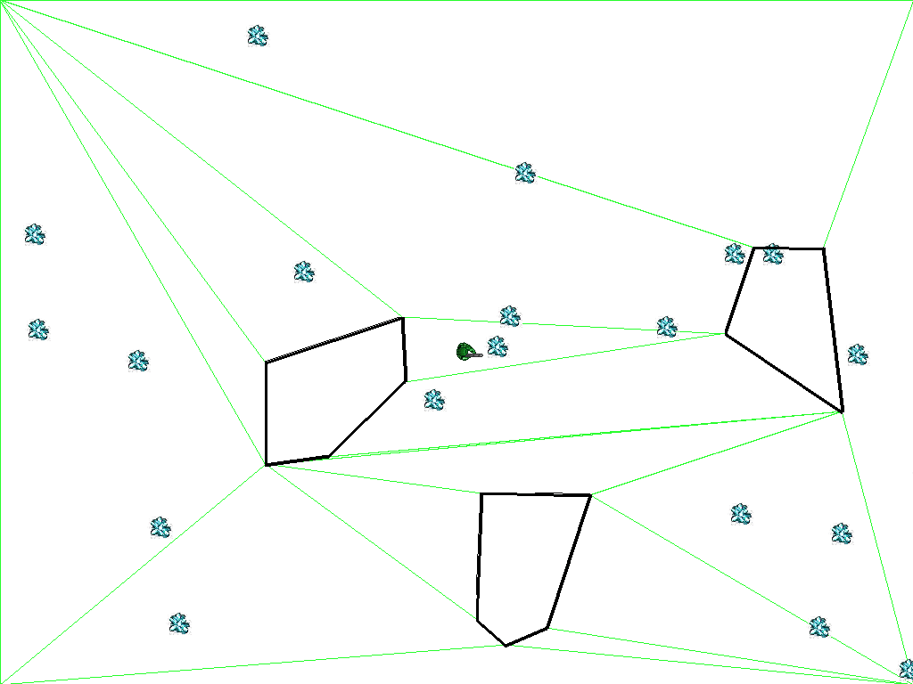
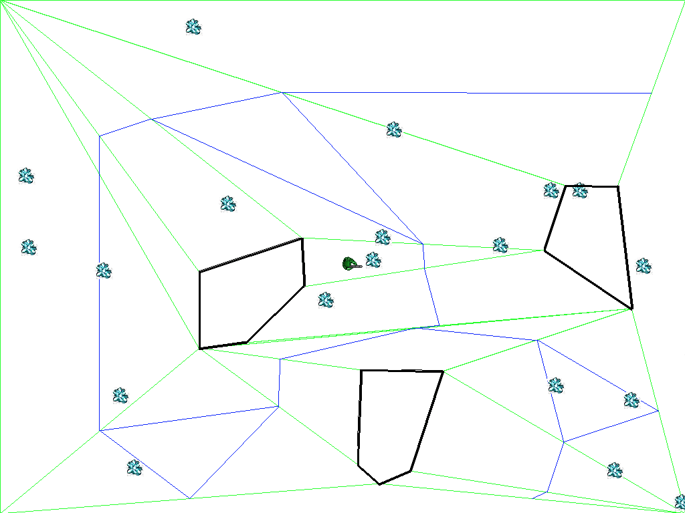

# Homework 3: Navigation Mesh Generation

One of the main uses of artificial intelligence in games is to perform _path planning_, the search for a sequence of movements through the virtual environment that gets an agent from one location to another without running into any obstacles. For now we will assume static obstacles. In order for an agent to engage in path planning, there must be a topography for the agent to traverse that is represented in a form that can be efficiently reasoned about.

Grid topologies discretize the environment and assumes an agent can be in one discrete cell or another. However, for many games such as 1st-person shooters, a more continuous model of space is beneficial. Depending on the granularity of the grid, a lot of space around obstacles becomes inaccessible in grid-based approaches. Finally, grids result in unneccessarily large number of path transitions.

A **path network** is a set of path nodes and edges that facilitates obstacle avoidance. The path network discretizes a continuous space into a small number of points and edges that allow transitions between points. However, unlike a grid topology, a path network does not require the agent to be at one of the path nodes at all times. The agent can be at any point in the terrain. When the agent needs to move to a different location and an obstacle is in the way, the agent can move to the nearest path node accessible by straight-line movement and then find a path through the edges of the path network to another path node near to the desired destination.

A **navigation mesh** is a means to automatically identify points at which to place path nodes. A navigation mesh is a set of convex hulls (polygons) overlayed on an environment such that the area wihin each hull is guaranteed to be obstacle-free. Note the relatively small number of convex hulls needed to map out navagable areas in the figure below. The convexity of the hulls is important because an agent within the area of a hull can move to any other point within the hull without crossing a hull boundary.

Furthermore, when two convex hulls are adjacent to each other (i.e., they share an edge), that edge can be thought of as a "portal"---an invisible door---from one safe navigation region to another. Connecting adjacent convex hulls into a network of safe passages results in a path node network through which an agent can travel between any two points in the environment without fear of collision. That is, a navigation mesh can be used to automatically place path nodes throughout a game map. The resulting network of path nodes creates a super-highway by which an agent can move from any safe area to any other safe area.

There are many ways to convert a navigation mesh into a pathnode network. In the figure below, I have chosen to place path nodes at the center points of each portal and to generate edges between nodes that are on the same convex hull. This keeps the number of nodes and edges low and ensures that the paths are far away from obstacles. It does create a bit of inefficiency since the path network may take the agent a little bit out of its way. However, there are opportunities to "smooth" the path by taking shortcuts or cutting corners, resulting in conservative but naturalistic looking navigation.

In this assignment, you will write the code to generate a navigation mesh for an arbitrary environment and to generate a path network for the environment. The path network should work on any given terrain of obstacles and allow the agent to traverse between any two points (as long as there exists a path wide enough for the agent to fit) without colliding with an obstacle.

There are three main challenges of the assignment:

1.  Generate a navigation mesh
2.  Choose where to place the path nodes
3.  Generate a path network

We will test path network using a random-walk navigator that moves the agent to the nearest path node and then follows a randomly generated path---sequence of adjacent path nodes.

* * *

## What you need to know

Please consult [homework 1](Homework1.md) for background on the Game Engine. In addition to the information about the game engine provided there, the following elements will be used.

### PathNetworkNavigator

PathNetworkNavigator is defined in core.py. A PathNetworkNavigator is a specialization of a Navigator that works on path networks and contains the smarts for how to get around in the game world. Its primary function is to compute a path between two points that steers the Agent clear of any obstacles.

Member variables:

*   pathnodes: a list of points of the form (x, y) that comprise a path network.
*   pathnetwork: a list of lines of the form ((x1, y1), (x2, y2)) that comprise a path network.

Member functions:

*   computePath(source, destination): Find a path through the path network (causing path to be not None) and call back to the Agent to start moving. This default functionality just instructs the agent to move to the destination.

### NavMeshNavigator

NavMeshNavigator is defined in core.py. NavMeshNavigator is a specialization of PathNetworkNavigator that automatically constructs a navigation mesh and a path network.

Member variables:

*   navmesh: a list of convex polygons, where a polygon is a list of points and a point is a tuple of the form (x, y).

Member functions:

*   createPathNetwork(world): takes a GameWorld and creates the navigation mesh and path network. As a side-effect, navmesh, pathnodes and pathnetwork are instantiated. The default behavior implemented here is to do nothing.

### RandomNavMeshNavigator

RandomNavMeshNavigator is defined in randomnavmeshnavigator.py. The RandomNavMeshNavigator causes the Agent to perform a random walk of the path network. The random path terminates after 100 path nodes and the Agent moves directly to its destination from the last random point reached. Thus, the Agent can possibly collide with obstacles if random path does not reach the destination before the threshold is reached.

Member functions:

*   computePath(source, destination): Find a path through the path network (causing path to be not None) and call back to the Agent to start moving. This default functionality just instructs the agent to move to the destination. The path is created by finding the closest path nodes to the source and then randomly selecting successor path nodes in the path network until the closest node to the destination is found. If the path length exceeds 100, then the Agent will be sent to its destination without further collision avoidance.
*   createPathNetwork(world): takes a GameWorld and creates the navigation mesh and path network. As a side-effect, navmesh, pathnodes and pathnetwork are instantiated. The function calls myCreatePathNetwork(world, agent) helper function, which is a non-member function that creates the navigation mesh, path nodes, and path network.

### Miscellaneous utility functions

Miscellaneous utility functions are found in utils.py.

*   minimumDistance(line, point): returns the shortest distance between a point (x, y) and a line ((x1, y1), (x2, y2)).
*   findClosestUnobstructed(point, nodes, lines): returns the point in nodes that is closest to the given point for which none of the given lines comes between the found point and the given point.
*   pointOnPolygon(point, polygon): returns true when a point (x, y) is on the boundary of a polygon. A polygon is a list of points of the form (x, y).
*   drawPolygon(polygon, surface, color, width, center): draws a polygon to the given PyGame rendering surface. A polygon is a list of points of the form (x, y). Color is a tuple (red, green, blue) where each value is an integer between 0 and 255\. Width indicates the thickness of lines. center is a boolean indicating whether the centerpoint of the polygon should be marked.
*   polygonsAdjacent(polygon1, polygon2): returns true if two polygons are adjacent. A polygon is a list of points of the form (x, y).
*   isConvex(points): returns true if all the angles made up by a list of points are convex. Points is a list (point1, point2, ..., pointN) and a point is a tuple (x, y). The list must contain at least three points.
*   findClosestUnobstructed(point, nodes, lines): returns the point in nodes that is closest to the given point for which none of the given lines comes between the found point and the given point.

* * *

## Instructions

To complete this assignment, you must (1) implement code to generate a navigation mesh for an arbitrary game world terrain consisting of obstacles such that an Agent can traverse the environment, and (2) implement code to generate a path node network in the environment. Because we haven't gotten to the part where the Agent can be controlled intelligently, we will use a the RandomNavMeshNavigator, which walks randomly around for a while before proceeding directly to its destination.

To run the project code, use the following commands:

**> python runrandomnavigator0.py  
> python runrandomnavigator1.py  
> python runrandomnavigator2.py  
> python runrandomnavigator3.py  
> python runrandomnavigator4.py**

Modify mycreatepathnetwork.py and complete the myCreatePathNetwork() function. myCreatePathNetwork() must do three things:

1.  It must compute the navigation mesh as a list of polygons. A polygon is a list of points of the form (x, y). All of the polygons must be convex hulls and no part of a navigation mesh polygon can be inside an Obstacle objects.
2.  It must compute the path nodes to a list of points, where a point is a tuple of the form (x, y).
3.  It must compute the path network as a list of lines, where a line is ((x1, y1), (x2, y2)).

myCreatePathNetwork(world, agent) takes in a reference to the GameWorld object and a reference to the agent that will be navigating on the path network. The function returns three values:

1.  A list of path nodes, where each path node is a point of the form (x, y)
2.  A list of edges between path nodes, where every edge is of the form ((x1, y1), (x2, y2))
3.  The navigation mesh, which is a list of convex hulls. A convex hull is a list of points such that adjacent points in the list make up the edges of the polygon, as well as the first and last point in the list.

**Step 1:** Find convex hulls.

A simple means of finding convext hulls are to create triangles between the points of Obstacles (and the corners of the map). From any point on any Obstacle, find two other points such that a triangle can be formed through open space. Make sure that any triangle found doesn't overlap with any previously found triangle.

Triangles are guaranteed to be convex hulls, but it is possible to find bigger polygons with n > 3 points that carve out larger parts of the open space. Fewer, more complex convex hulls produce more optimized path networks. Identify adjacent polygons that can be merged together to form larger convex hulls.

**Step 2:** Place path nodes.

There are many strategies for placing path nodes in navigation meshes. Popular strategies include.

*   Place path nodes in the centers of convex hulls.
*   Place path nodes in the centers of "portals"---the lines that are shared between two convex hulls.
*   Place path nodes at the corners of of convex hulls, but offset so that the agent doesn't collide with obstacles when approaching the path nodes.

Each strategy has pros and cons. The above strategies can be combined.

**Step 3:** Create path edges between path nodes.

There are many strategies for doing this. Common strategies include:

*   Create edges between all path nodes for which there are no obstructions in between (i.e., trace a ray from every path node to every other path node).
*   Create edges between path nodes that participate in the same convex hull.

One key consideration is to keep the number of edges in the path network as small as possible while ensuring that there is at least one path between all convex hulls that should be reachable from each other. Reducing the complexity of the path network will speed up path search later. Another key consideration is to keep the actual physical distance an agent must travel between any two points as low as possible. These considerations are often in conflict with each other.

* * *

## Grading

We will grade your solution based on three criteria:

*   **Reachability (6 points):** the path network should not be a disjoint graph such that an agent should be able to move from any point in the map to any other point in the map. We will run your solution a number of times on a number of maps and average the results.
*   **Coverage (2 points):** the navigation mesh should cover the entire navigable area of the map, no more and no less. We will compute difference between the actual navigable area and the sum area of the convex hulls in the navigation mesh. The penalty is the percentage difference. We will do this for a number of maps and average the results.
*   **Mesh optimization (2 points):** 1 point for implementing the ability to produce convex hulls with at least 4 sides. 2 points for implementing the ability to produce convex hulls with more than 4 side. You will receive no points if you produce any non-convex hulls.

* * *

## Hints

Make sure any edge in the path network is traversable by an agent that has physical size. That is, edges in the path network should never come too close to any Obstacle such that an agent blindly following the path edge collides with an Obstacle (or the edges of the map).

When creating triangles, I like to randomly pick points on obstacles and exhaustively find all triangles from that point, then move on to the next random point.

Path nodes can be placed on the edges of the game map.

* * *

## Submission

To submit your solution, upload your modified mycreatepathnetwork.py. All work should be done within this file.

You should not modify any other files in the game engine.

DO NOT upload the entire game engine.